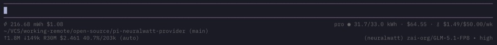

<div align="center">

# ⚡ pi-neuralwatt-provider

**Models + energy tracking via [Neuralwatt](https://neuralwatt.com)**

_Kimi, GLM, Qwen, DeepSeek — with real-time ⚡ energy/cost per session for [pi](https://github.com/earendil-works/pi-coding-agent)._

[](https://github.com/earendil-works/pi-coding-agent)
[](./LICENSE)

</div>

---



## Features

- **OpenAI-compatible API** - Uses Neuralwatt's `/v1/chat/completions` endpoint
- **Reasoning models** - Support for thinking models with `reasoning_effort` parameter
- **Vision models** - Image input support on Kimi K2.5, K2.6, and Devstral
- **Tool use** - Function calling support
- **Streaming** - Real-time token streaming
- **Fast variants** - Optimized "Fast" versions of popular models for quicker responses
- **Energy reporting** - Displays energy consumption (⚡J/mWh/Wh/kWh) and actual billed cost ($) in a dedicated status widget below the editor, tracked per-session
- **Quota display** - Shows subscription plan, kWh allocation, and credits remaining from your Neuralwatt account, right-aligned in the status widget
- **Configurable display** - Energy and quota can each be shown in the below-editor widget, the built-in status bar, or turned off entirely via a config file

## Available Models

| Model | Context | Vision | Reasoning | Input $/M | Output $/M |
|-------|---------|--------|-----------|-----------|------------|
| GLM 5.1 long (coherence canary: keep-recent 48k) | 1.0M | ❌ | ✅ | $1.10 | $3.60 |
| GLM-5 Fast | 203K | ❌ | ❌ | $1.10 | $3.60 |
| GLM-5.1 | 203K | ❌ | ✅ | $1.10 | $3.60 |
| GLM-5.1 (flex) | 203K | ❌ | ✅ | $1.10 | $3.60 |
| GLM-5.1 Fast | 203K | ❌ | ❌ | $1.10 | $3.60 |
| GLM-5.1 Long (Virtual Context) | 1.0M | ❌ | ✅ | $1.10 | $3.60 |
| Kimi K2.5 | 262K | ✅ | ✅ | $0.52 | $2.59 |
| Kimi K2.5 Fast | 262K | ✅ | ❌ | $0.52 | $2.59 |
| Kimi K2.6 | 262K | ✅ | ✅ | $0.69 | $3.22 |
| Kimi K2.6 (flex) | 262K | ✅ | ✅ | $0.69 | $3.22 |
| Kimi K2.6 Fast | 262K | ✅ | ❌ | $0.69 | $3.22 |
| Kimi K2.6 Long (Virtual Context) | 1.0M | ✅ | ✅ | $0.69 | $3.22 |
| Kimi K2.7 Code | 262K | ✅ | ✅ | $0.95 | $4.00 |
| Qwen3.5 397B | 262K | ❌ | ✅ | $0.69 | $4.14 |
| Qwen3.5 397B Fast | 262K | ❌ | ❌ | $0.69 | $4.14 |
| Qwen3.6 35B | 131K | ✅ | ✅ | $0.29 | $1.15 |
| Qwen3.6 35B Fast | 131K | ✅ | ❌ | $0.29 | $1.15 |
| GLM-5.1 Canary | 203K | ❌ | ✅ | $1.10 | $3.60 |
| GLM-5.1 NVFP4 Canary | 203K | ❌ | ✅ | $1.10 | $3.60 |
| Kimi K2.6 Canary | 262K | ✅ | ✅ | $0.69 | $3.22 |
| GLM-5 Long (MCR 1M) | 1.0M | ❌ | ✅ | $1.10 | $3.60 |
| GLM-5.1 Fast Long (MCR 1M) | 1.0M | ❌ | ❌ | $1.10 | $3.60 |
| Kimi K2.5 Long (MCR 1M) | 1.0M | ✅ | ✅ | $0.52 | $2.59 |
| GLM-5.1 (FP8) | 203K | ❌ | ✅ | $1.10 | $3.60 |
| Kimi K2.6 | 262K | ✅ | ✅ | $0.69 | $3.22 |
| Qwen3.6 35B (A3B) | 131K | ✅ | ✅ | $0.29 | $1.15 |
| Claude Opus (Cached) | 1.0M | ❌ | ✅ | $0.00 | $0.00 |

## Authentication

The Neuralwatt API key can be configured in multiple ways (resolved in this order):

1. **`auth.json`** (recommended) — Add to `~/.pi/agent/auth.json`:
   ```json
   { "neuralwatt": { "type": "api_key", "key": "your-api-key" } }
   ```
   The `key` field supports literal values, env var names, and shell commands (prefix with `!`). See [pi's auth file docs](https://github.com/badlogic/pi-mono) for details.
2. **Runtime override** — Use the `--api-key` CLI flag
3. **Environment variable** — Set `NEURALWATT_API_KEY`

Get your API key from [neuralwatt.com](https://neuralwatt.com).

## Installation

### Option 1: Using `pi install` (Recommended)

Install from npm:

```bash
pi install npm:pi-neuralwatt-provider
```

Or install directly from GitHub:

```bash
pi install https://github.com/monotykamary/pi-neuralwatt-provider
```

### Option 2: With npm

Install from npm:

```bash
npm install npm:pi-neuralwatt-provider
```

### Option 3: Manual Clone

Then authenticate and run pi:
```bash
# Recommended: add to auth.json
# See Authentication section below

# Or set as environment variable
export NEURALWATT_API_KEY=your-api-key-here

pi
```

1. Clone this repository:
   ```bash
   git clone git@github.com:monotykamary/pi-neuralwatt-provider.git
   cd pi-neuralwatt-provider
   ```

2. Configure your Neuralwatt API key:
   ```bash
   # Recommended: add to auth.json
   # See Authentication section below

   # Or set as environment variable
   export NEURALWATT_API_KEY=your-api-key-here
   ```

3. Run pi with the extension:
   ```bash
   pi -e /path/to/pi-neuralwatt-provider
   ```

## Environment Variables

| Variable | Required | Description |
|----------|----------|-------------|
| `NEURALWATT_API_KEY` | No | Your Neuralwatt API key (fallback if not in auth.json) |

## Configuration

### Compat Settings

Neuralwatt's API now provides compatibility and capability metadata (pricing, reasoning, vision, developer_role, reasoning_effort, max_images) directly in the `/v1/models` response. The `update-models.js` script reads these and writes them into `models.json`. Only genuinely incorrect API data needs a manual override in `patch.json`.

Currently configured compat settings (all sourced from the API):

- **`supportsDeveloperRole: false`** — All models. vLLM doesn't support the `developer` role; pi sends system prompts as `system` messages instead.
- **`supportsReasoningEffort: true`** — GPT-OSS. Sends `reasoning_effort` parameter (maps to pi's `/reasoning` command levels).

### Custom Stream Handler

This extension registers a custom `streamSimple` provider (`api: "neuralwatt"`) that wraps pi-ai's built-in `streamOpenAICompletions`. A temporary `globalThis.fetch` override tees the HTTP response body so the OpenAI SDK handles all standard chunk parsing (text, thinking, tool calls, usage) while the extension reads the tee for Neuralwatt's SSE comment lines (`: energy {...}`, `: cost {...}`) that the SDK discards.

### Pi Configuration

Add to your pi configuration for automatic loading:

```json
{
  "extensions": [
    "/path/to/pi-neuralwatt-provider"
  ]
}
```

## Usage

Once loaded, select a model with:

```
/model neuralwatt kimi-k2.5
```

Or use `/models` to browse all available Neuralwatt models.

### Reasoning Effort

For reasoning models, control thinking depth:

```
/reasoning high
```

Values: `none`, `low`, `medium`, `high`

## Display Configuration

Energy and quota are independently configurable. Create `~/.pi/agent/extensions/neuralwatt.json`:

```json
{
  "energy": "widget",
  "quota": "widget"
}
```

The file is auto-populated with defaults on first run.

| Key | Values | Default | Description |
|-----|--------|---------|-------------|
| `energy` | `"widget"`, `"statusbar"`, `"off"` | `"widget"` | Energy/cost display mode |
| `quota` | `"widget"`, `"statusbar"`, `"off"` | `"widget"` | Quota display mode |

**Display modes:**

- **`"widget"`** — Shown in the dedicated below-editor status line. Energy on the left, quota on the right, padded to terminal width.
- **`"statusbar"`** — Shown in the built-in pi status bar. When both are set to `"statusbar"`, they're combined with a ` | ` separator: `⚡X J $Y | plan ● kWh ∙ $bal`.
- **`"off"`** — Hidden entirely. For `"quota": "off"`, the `/v1/quota` API fetch is also skipped (saving a network round-trip). Energy data is still parsed from the SSE stream and persisted to the session even when `"off"`.

**Example — custom quota footer:** If you use your own unified quota footer extension, disable the built-in quota display to avoid duplication:

```json
{
  "energy": "widget",
  "quota": "off"
}
```

## Energy Reporting

Neuralwatt provides real-time energy consumption data with every API response. This extension captures it and displays a running total in a dedicated status widget between the editor and the pi footer:

| Segment | Meaning |
|---------|----------|
| `⚡0.8mWh` | Cumulative session energy consumption (auto-scaled: J → mWh → Wh → kWh) |
| `$0.003952` | Cumulative session actual billed cost from Neuralwatt |
| `pro` | Your Neuralwatt subscription plan |
| `●` | Subscription status indicator (● = active, ⊘ = past due/paused) |
| `31.7/33.0 kWh` | kWh remaining / kWh included in your plan |
| `∙ $64.55` | Credits remaining on your account |
| `🔑 .../.../mo` | Key allowance usage (if set on your API key) |

The energy and cost data comes from Neuralwatt's SSE stream comments (`: energy` and `: cost`), which the standard OpenAI SDK discards. This extension uses a custom stream handler that parses raw SSE to capture them.

Energy is measured directly from GPU hardware using NVIDIA's NVML. For concurrent requests, Neuralwatt uses token-weighted attribution to fairly calculate your share. See [Neuralwatt's energy methodology](https://portal.neuralwatt.com/docs/energy-methodology) for details.

### Persistence

Energy and cost data is persisted per-request as custom session entries. On session resume or tree navigation, the totals are rebuilt by replaying all events in the current branch. This means:

- **Session resume** — Energy/cost totals are restored when you continue a session
- **Branching** — Navigating to a different point in the session tree shows the correct totals for that branch
- **Forking** — Forked sessions carry their energy history forward

## API Documentation

- Neuralwatt API: `https://api.neuralwatt.com/v1`
- Models endpoint: `https://api.neuralwatt.com/v1/models`
- Chat completions: `https://api.neuralwatt.com/v1/chat/completions`

## License

MIT
